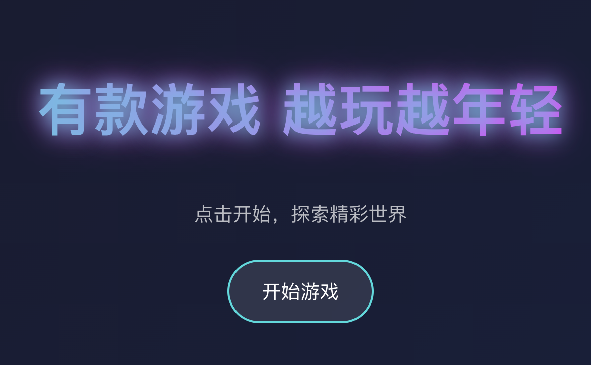

# Heisi Game

A modern web-based game built with React and Framer Motion.

## 🎮 Game Screenshots

<div align="center">
  
  
  
</div>

## 🚀 Features

- Built with React 18
- Smooth animations using Framer Motion
- Responsive design
- React Router for navigation
- Styled Components for styling

## 📦 Installation

1. Clone the repository:
```bash
git clone https://github.com/EazyLee30/heisi-game.git
cd heisi-game
```

2. Install dependencies:
```bash
npm install
```

3. Start the development server:
```bash
npm start
```

The application will be available at `http://localhost:7788`

## 🛠️ Available Scripts

- `npm start` - Runs the app in development mode
- `npm test` - Launches the test runner
- `npm run build` - Builds the app for production
- `npm run eject` - Ejects from Create React App

## 🏗️ Project Structure

```
heisi-game/
├── public/          # Static files
├── src/             # Source code
├── build/           # Production build
├── nginx.conf       # Nginx configuration
└── deploy.sh        # Deployment script
```

## 🔧 Dependencies

- React 18.2.0
- React Router DOM 6.18.0
- Framer Motion 10.16.4
- Styled Components 6.0.7
- React Swipeable 7.0.1

## 🚀 Deployment

The project includes a deployment script (`deploy.sh`) for easy deployment to a server. To deploy:

```bash
./deploy.sh
```

## 📝 License

This project is licensed under the MIT License.

## 🤝 Contributing

Contributions are welcome! Please feel free to submit a Pull Request.

## 📞 Contact

For any questions or suggestions, please open an issue in the GitHub repository. 