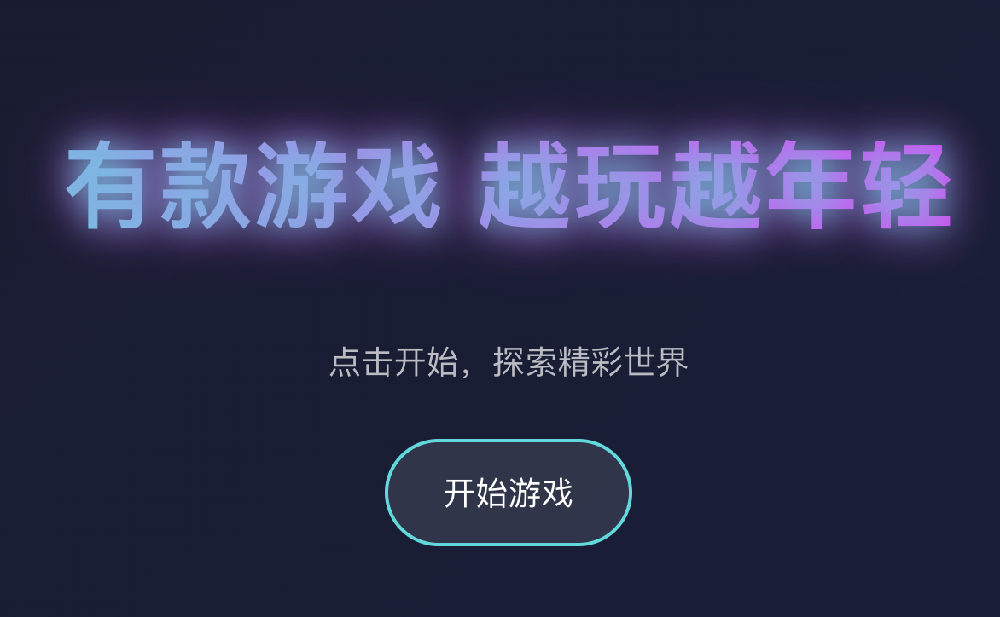
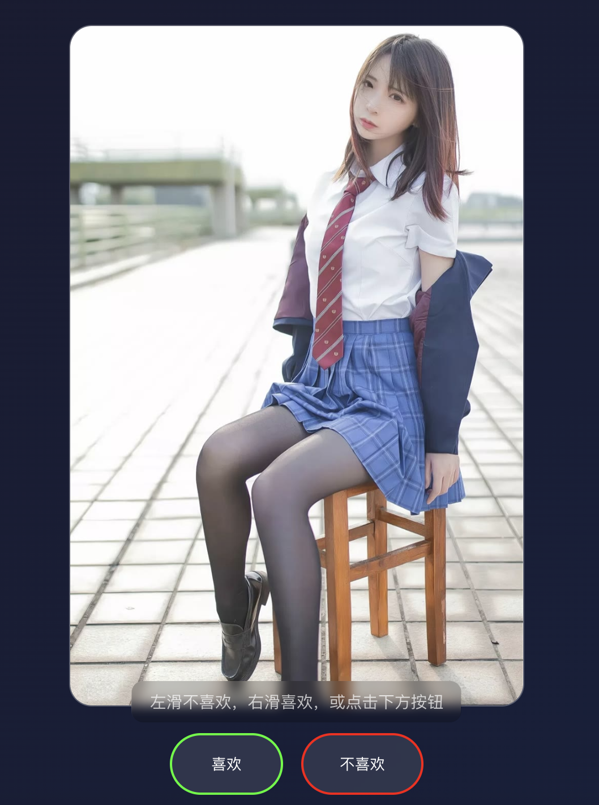

# 黑丝游戏

<div align="right">
  <a href="./README.md">English</a> | <a href="./README.zh-CN.md">简体中文</a>
</div>

一个使用外部API显示随机黑丝图片的简单网页应用。

## 🎮 演示

在线试玩： [https://heisi-game.vercel.app](https://heisi-game.vercel.app)

<div align="center">
  
</div>

## 🎮 游戏截图

<div align="center">
  
  
  
</div>

## 💡 项目灵感

本项目灵感来源于一个随机黑丝图片API，该API通过简单的GET请求提供高质量的图片。

## 🔌 API信息

- API接口地址：https://v2.api-m.com/api/heisi
- 返回格式：JSON/IMG
- 请求方式：GET
- 可选参数：`return=302`（用于获取直接图片URL）

## ✨ 功能特点

- 简洁清爽的界面
- 随机黑丝图片显示
- 易于使用的API集成
- 响应式设计
- 流畅的图片加载
- 现代化的UI/UX

## 🚀 开始使用

1. 克隆仓库：
```bash
git clone https://github.com/EazyLee30/heisi-game.git
cd heisi-game
```

2. 安装依赖：
```bash
npm install
```

3. 运行应用：
```bash
npm start
```

## 📝 使用方法

只需向API接口发送GET请求即可获取JSON格式的随机黑丝图片。

## 📄 许可证

MIT许可证

## 🤝 贡献

欢迎贡献！请随时提交 Pull Request。

## 📞 联系方式

如有任何问题或建议，请在 GitHub 仓库中提交 issue。 
